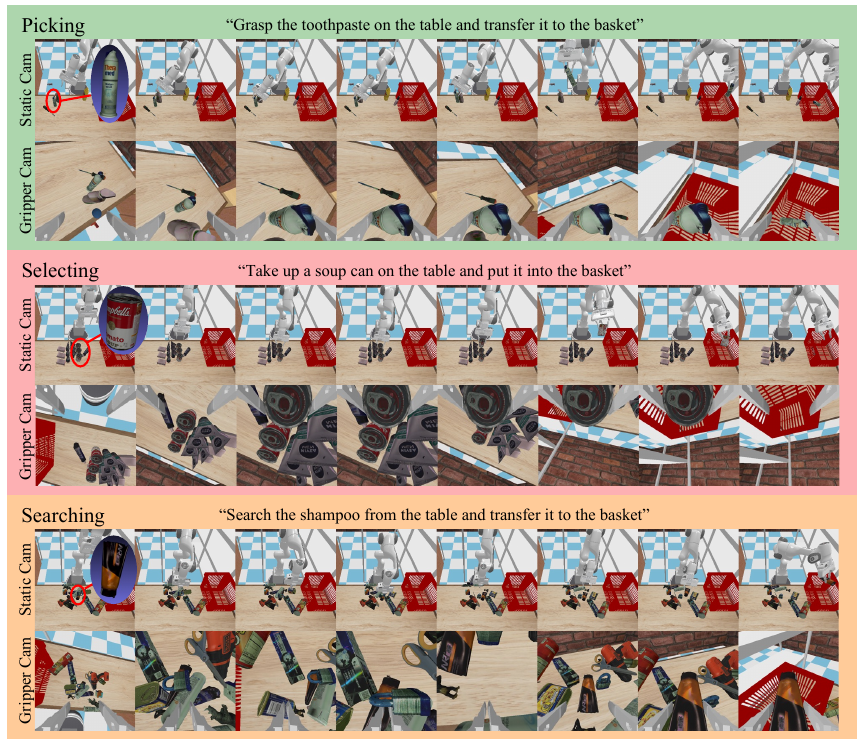
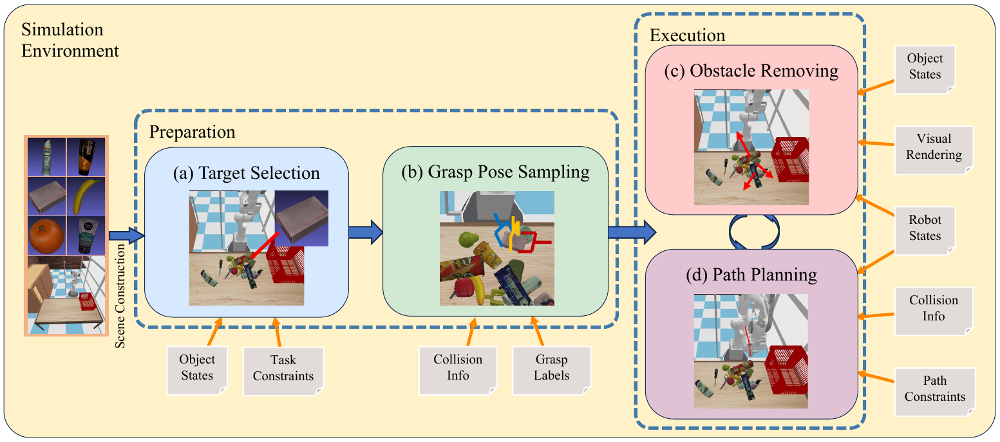

# RoboCAS: A Benchmark for Robotic Manipulation in Complex Object Arrangement Scenarios

## Introduction

We introduces the RoboCAS benchmark, a benchmark specifically designed for complex object arrangement scenarios in robotic manipulation.
This benchmark employs flexible and concise scripted policies to efficiently collect a diverse array of demonstrations,
showcasing scattered, orderly, and stacked object arrangements within a highly realistic physical simulation environment.
It includes complex processes such as target retrieval, obstacle clearance, and robot manipulation,
testing agents' abilities to perform long-horizon planning for spatial reasoning and predicting chain reactions under ambiguous instructions.




## Quick Start
The generated demonstration can be acquired on [hugging face](https://huggingface.co/datasets/zlm898/RoboCAS-v0/discussions/1#66624ff3f8d1fcc749a8cf52).

1. Clone this repository locally
```shell
git clone https://github.com/notFoundThisPerson/RoboCAS-v0.git
git submodule init
git submodule update
```

2. Download the assets from [PartNet-Mobility](https://sapien.ucsd.edu/browse) and [GraspNet-1Billion](https://graspnet.net/datasets.html) and put them into *assets*.
The structure of *assets* directory should be:
```
assets
|-- graspnet
|   |-- grasp_label
|   |-- graspness
|   |-- models
|   |-- simplified_models (Generated by ourselves)
|   |-- filtered_grasps (Generated by ourselves)
|   |-- grasp_label_simplified (Generated by ourselves)
|
|-- PartNet-Mobility
    |-- dataset
    |   |-- ...
    |
    |-- partnet_mobility_dict.json
```

The PartNet-Mobility asserts used in our demonstration are stored in the *asserts/PartNet-Mobility/dataset* and do not need to be downloaded. 
Note that the *scenes* and *collision_label* directories in GraspNet dataset is not needed in our benchmark. 
After downloading the GraspNet dataset, we can generate the *grasp_label_simplified* directory using [simplify_dataset.py](https://github.com/graspnet/graspness_unofficial/blob/main/dataset/simplify_dataset.py) from repository [graspness_unofficial](https://github.com/graspnet/graspness_unofficial/tree/main).
The directory *filtered_grasps* will be generated during the trajectory generation process in our code.

3. Generate trajectory. The **task** parameter can be chosen from [pick, select, task].
```shell
sh collect_data.sh [task] [num_episodes]
# e.g.: sh collect_data.sh pick 500
```

## Baseline Model Training
The benchmark is tested using RT-1 base on the work of [IOAI](https://github.com/ioai-tech/pytorch_rt1_with_trainer_and_tester).

### Training
To train the RT-1 model provided in [3rd_party/rt1-ioai](3rd_party/rt1-ioai/README.md), run 
```shell
cd 3rd_party/rt1-ioai
# Edit the parameters in "mt_train_config.json"
python -m torch.distributed.launch --nproc_per_node=8 --nnodes=1 --use_env mt_trainer_torch.py
```

### Evaluation
The [evaluate_mt.sh](3rd_party/rt1-ioai/evaluate_mt.sh) will perform the RT-1 model in our RoboCAS environment on the specified weight file specified by path **"$ckpt_dir/$model_name"**.
```shell
sh evaluate_mt.sh
```

## Dataset Structure

Trajectories on [hugging face](https://huggingface.co/datasets/zlm898/RoboCAS-v0/discussions/1#66624ff3f8d1fcc749a8cf52) are contained in the zip files,each contains the following tasks:
```
scattered.zip: Picking task in the scattered scene.
orderly.zip: Selecting task in the orderly scene.
stacked.zip: Searching task in the stacked scene.
```
Details can be found in the paper.
Each trajectory is arranged as the following structure:
```
.
|-- data_info.json                          # Overview of the dataset information, in dictionary format.
|-- episode_0000000                         # Trajectory 0.
|   |-- episode_info.npz                    # Actions and robot states in the trajectory.
|   |-- gripper_camera                      # Data of the camera mounted on the gripper.
|   |   |-- cam_pos_wrt_${parent}.npy       # Camera pose w.r.t. its parent link.
|   |   |-- intrinsic.npy                   # Intrinsic of this camera.
|   |   |-- rgb                             # RGB images in this trajectory.
|   |   |   |-- 0000.png                    # Image at step 0.
|   |   |   |-- ...
|   |   |
|   |   |-- depth                           # Depth images in this trajectory. Same structure as "rgb".
|   |       |-- ...
|   |
|   |-- base_camera                         # Data of the camera mounted on the robot base. Same structure as "gripper_camera".
|   |   |-- ...
|   |
|   |-- static_camera                       # Data of the camera mounted on the ground. Same structure as "gripper_camera".
|       |-- ...
|
|-- episode_0000001                         # Same structure as "episode_0000000".
|-- ...
```
In each trajectory folder, the *episode_info.npz* file contains the trajectory of the agent, the structure and the explanations of each item is as follows. 
All of the Quaternion in our dataset are stored in "xyzw" order.
All relative transforms are calculated under the frame of the last time step, i.e. $\Delta T_{t} = T_{t-1}^{-1} T_{t}$, where $\Delta T_{t}, T_{t} \in SE(3)$ are the relative action and the pose at time step $t$.
```
rel_pos             # Relative position shift of the EEF w.r.t. the last EEF pose in Cartesian coordinate.
rel_orn             # Relative orientation shift of the EEF w.r.t. the last EEF pose in Quaternion.
ee_pos              # Absolute position of the EEF w.r.t. the arm base in Cartesian coordinate.
ee_orn              # Absolute orientation of the EEF w.r.t. the arm base in Quaternion.
robot_joints        # Joint angles of the arm.
arm_joint_vel       # Velocities of the arm joints.
base_pos            # Position of the arm base w.r.t. the world in Cartesian coordinate.
base_orn            # Orientation of the arm base w.r.t. the world in Quaternion.
base_rel_pos        # Relative position shift of the arm base w.r.t. the the pose in last step in Cartesian coordinate.
base_rel_orn        # Relative orientation shift of the arm base w.r.t. the the pose in last step in Quaternion.
gripper_width       # Open width of the gripper fingers.
gripper_status      # Open/close command of the gripper.
episode_length      # Length of the trajectory.
language_goal       # Global goal instruction of this trajectory.
language_embedding  # Embedding of the goal instruction generated by \href{https://huggingface.co/sentence-transformers/all-MiniLM-L6-v2}{Mini LAMMA}.
step_lang_goals     # Goal annotation of the sub-task for each step of action in this trajectory.
step_goal_embs      # Embedding of step goals generated by \href{https://huggingface.co/sentence-transformers/all-MiniLM-L6-v2}{Mini LAMMA}.
step_goal_type      # Type of the sub-task goals in each step.
```

---

## Cite
```
@inproceedings{zheng2024robocas
    title={RoboCAS: A Benchmark for Robotic Manipulation in Complex Object Arrangement Scenarios},
    author={Liming Zheng and Feng Yan and Fanfan Liu and Chengjian Feng and Zhuoliang Kang and Lin Ma},
    year={2024},
    booktitle={NeurIPS: Datasets and Benchmarks Track}
}
```

---

## License
MIT license
